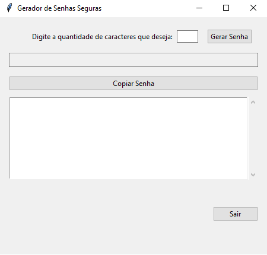

# Gerador De Senhas 🔒
Uma aplicação desktop para geração de senhas seguras com interface intuitiva, desenvolvida em Python utilizando Tkinter.



## Recursos Principais

- 🔒 Gera senhas com 4 tipos de caracteres:
  - Letras maiúsculas (A-Z)
  - Letras minúsculas (a-z)
  - Números (0-9)
  - Caracteres especiais (!@#$%^&*...)
- 🖥 Interface gráfica amigável
- 📋 Histórico completo de senhas geradas
- 📋 Copiar senha para área de transferência
- 📤 Visualização do histórico completo ao sair
- ⚡ Geração rápida e eficiente

# Pré-requisitos ⚙️

- Python 3.8 ou superior
- Biblioteca Tkinter (incluída na instalação padrão do Python)

## Execução Detalhada

**Clone o repositório:**  
 ```bash  
 git clone https://github.com/seu-usuario/gerador-senhas.git  
 ```  
**Acesse a pasta do projeto:**  
 ```bash  
 cd gerador-senhas  
 ```  
**Execute o programa:**  
 ```bash  
 python senhas.py  
 ```

# Interface do Usuário 🖼️

1 - **Campo de Entrada**
  - Digite o número de caracteres desejado (mínimo 4)

2 - **Botões Principais**

`Gerar Senha`: Cria uma nova senha segura

`Copiar`: Copia a senha atual para a área de transferência

`Sair`: Encerra o programa e exibe o histórico completo

3 - **Histórico de Senhas**

  - Lista todas as senhas geradas durante a sessão
  - Scrollbar para navegação em listas longas

# Como Contribuir 🤝

1 - Faça um Fork do projeto

2 - Crie sua Branch de feature:
```bash
git checkout -b feature/nova-feature
```

3 - Commit suas mudanças:
```bash
git commit -m 'Adicionei uma nova funcionalidade'
```

4 - Push para a branch:
```bash
git push origin feature/nova-feature
```

5 - Abra um Pull Request

**Roadmap de Melhorias 🛣️**

  - Adicionar indicador de força da senha

  - Implementar temas (claro/escuro)

  - Opção de exportar histórico para arquivo .txt

  - Configurar complexidade da senha

  - Adicionar busca no histórico

  Desenvolvido por [Luiz Felipe Melo]
  